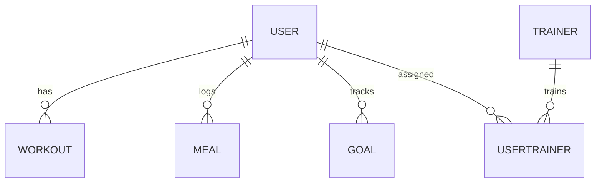

# FitFusion

A full-featured health and fitness backend system built using Node.js, Express, GraphQL, Sequelize, and MySQL. It supports user tracking, trainer assignments, workout and meal planning, and integrates with external weather data APIs. Includes frontend demonstration, CI/CD pipeline, logging, tests, and Docker containerization.

---

## 📌 Table of Contents

- [Project Overview](#project-overview)
- [System Architecture](#system-architecture)
- [Technology Stack](#technology-stack)
- [Database Design](#database-design)
- [API Design](#api-design)
- [External API Integration](#external-api-integration)
- [Frontend Demonstration](#frontend-demonstration)
- [Testing Strategy](#testing-strategy)
- [Logging Mechanism](#logging-mechanism)
- [CI/CD Pipeline](#cicd-pipeline)
- [Setup Instructions](#setup-instructions)
- [Postman/API Testing](#postmanapi-testing)
- [Deployment](#deployment)
- [Future Improvements](#future-improvements)

---

## 📚 Project Overview

FitFusion is a backend platform enabling fitness tracking and health goal management. Users can log meals, workouts, and goals, and be assigned to trainers. Real-time weather integration enhances outdoor activity planning. The project demonstrates skills in REST/GraphQL APIs, database design, Docker, testing, and DevOps automation.

---

## 🧱 System Architecture

FitFusion follows a modular monolithic architecture built with:

- Express.js for REST API
- GraphQL via graphql-http for flexible querying
- Sequelize ORM for SQL abstraction
- External API utilities
- React frontend as a separate container

 <!-- Replace with actual image if desired -->

While monolithic, the system is dockerized with separate services for frontend, backend, and database, allowing future migration to microservices if needed.

---

## ⚙️ Technology Stack

| Layer | Tech |
|------|------|
| Backend | Node.js, Express.js |
| API | GraphQL (graphql-http), REST |
| ORM | Sequelize |
| Database | MySQL |
| Frontend | React + Tailwind CSS (Vite) |
| CI/CD | GitHub Actions |
| Containerization | Docker + Docker Compose |
| Testing | Jest |
| Logging | Winston |
| External API | OpenWeatherMap |

---

## 🗄️ Database Design

- Type: SQL (MySQL)
- ORM: Sequelize
- Tables:
  - Users
  - Trainers
  - UserTrainer (many-to-many)
  - Workouts
  - Meals
  - Goals

Diagram:



- ✅ Relational constraints
- ✅ Validation rules (Sequelize)
- ✅ Complex queries supported via GraphQL resolvers

---

## 🧪 API Design

Supports both REST and GraphQL:

### GraphQL

- Endpoint: /graphql
- Playground: /graphiql
- Operations:
  - Create/Update/Delete: users, meals, workouts, goals
  - Query: users with nested goals and trainer info

Example Query:

```graphql
query {
  getUser(id: 1) {
    name
    goals {
      description
      status
    }
  }
}
```

### REST

- Routes:
  - GET/POST /users
  - PUT /goals/:id
  - DELETE /workouts/:id
  - GET /weather?city=Boston

- Validation using Express middleware
- Error-handling middleware for graceful failures

---

## 🌐 External API Integration

- API Used: OpenWeatherMap
- Purpose: Show weather for planning outdoor activities
- Usage:
  - Endpoint: /weather?city=London
  - Handled via utils/weather.js

Frontend displays:
- Temperature
- Condition
- Location

API key stored securely in `.env`

---

## 🖥️ Frontend Demonstration

- SPA built with React + Tailwind CSS
- Pages:
  - Home (summary)
  - Users (create/view/edit)
  - Workouts, Meals, Goals
  - Weather (weather API demo)
- Data fetched using Axios and GraphQL client


---

## ✅ Testing Strategy

- Framework: Jest
- Tests:
  - Unit tests for models (e.g. Meal.test.js)
  - Integration tests for routes and API (e.g. healthcheck, goals)
- Coverage:
  - User creation
  - Goal logging
  - Weather API call mocking

Run tests:

```bash
npm test
```

---

## 📜 Logging Mechanism

- Logger: Winston
- Logging levels: info, error, warn
- Logs to: console + rotating log files
- Sample:

```js
logger.info('User created:', userId);
logger.error('Database connection failed');
```

Location: utils/logger.js

---

## ⚙️ CI/CD Pipeline

- Platform: GitHub Actions
- File: .github/workflows/ci.yml
- Workflow:
  - Lint code
  - Run tests
  - Build Docker containers
  - Trigger deployment

Status badge:


---

## 🚀 Setup Instructions

### Prerequisites

- Docker & Docker Compose
- Node.js
- MySQL (if not using Docker DB)

### Local Development

1. Clone the repo:

```bash
git clone https://github.com/username/fitfusion.git
cd fitfusion
```

2. Create .env file:

```env
DB_USER=root
DB_PASS=yourpassword
DB_NAME=fitfusion
OPENWEATHER_API_KEY=your_api_key
```

3. Run with Docker:

```bash
docker-compose up --build
```

4. Access:

- Backend: http://localhost:4000
- GraphiQL: http://localhost:4000/graphiql
- Frontend: http://localhost:3000

---

## 🧪 Postman/API Testing Collection

### 🩺 Health Check
```
GET http://localhost:3000/health
```

---

### 👤 Users

- `GET /users` – Get all users  
- `GET /users/:id` – Get user by ID  
- `POST /users` – Create user  
```json
{
  "name": "John Doe",
  "email": "john@example.com",
  "password": "secret123"
}
```

- `PUT /users/:id` – Update user  
```json
{
  "name": "Updated Name"
}
```

- `DELETE /users/:id` – Delete user

---

### 🥗 Meals

- `GET /meals` – Get all meals  
- `GET /meals/:id` – Get meal by ID  
- `POST /meals` – Create meal  
```json
{
  "userId": 1,
  "name": "Oats and berries",
  "calories": 320,
  "time": "08:30"
}
```

- `PUT /meals/:id` – Update meal  
- `DELETE /meals/:id` – Delete meal

---

### 🏋️ Workouts

- `GET /workouts` – Get all workouts  
- `GET /workouts/:id` – Get workout by ID  
- `POST /workouts` – Create workout  
```json
{
  "userId": 1,
  "type": "HIIT",
  "duration": 45,
  "date": "2025-04-21"
}
```

- `PUT /workouts/:id` – Update workout  
- `DELETE /workouts/:id` – Delete workout

---

### 🎯 Goals

- `GET /goals` – Get all goals  
- `GET /goals/:id` – Get goal by ID  
- `POST /goals` – Create goal  
```json
{
  "userId": 1,
  "targetWeight": 68,
  "targetDate": "2025-07-01"
}
```

- `PUT /goals/:id` – Update goal  
- `DELETE /goals/:id` – Delete goal

---

### 🧑‍🏫 Trainers

- `GET /trainers` – Get all trainers  
- `GET /trainers/:id` – Get trainer by ID  
- `POST /trainers` – Create trainer  
```json
{
  "name": "Coach Maya",
  "specialization": "Yoga"
}
```

- `PUT /trainers/:id` – Update trainer  
- `DELETE /trainers/:id` – Delete trainer

---

### 🔐 Auth

- `POST /auth/login` – Authenticate user  
```json
{
  "email": "john@example.com",
  "password": "secret123"
}
```

---

### ☀️ Weather

- `GET /weather?city=Boston` – Get weather by city

---

## 🔮 GraphQL API

### Endpoint

```
POST http://localhost:3000/graphql
```

### Playground

```
GET http://localhost:3000/graphiql
```

---

### 📥 Queries

#### Fetch single user with nested goals & meals
```graphql
query {
  getUser(id: 1) {
    id
    name
    email
    meals {
      name
      calories
    }
    goal {
      targetWeight
    }
  }
}
```

#### Fetch weather
```graphql
query {
  getWeather(city: "London") {
    city
    temperature
    description
  }
}
```

---

### 🛠 Mutations

#### Create user
```graphql
mutation {
  createUser(input: {
    name: "Alice",
    email: "alice@mail.com",
    password: "pass123"
  }) {
    id
    name
  }
}
```

#### Create workout
```graphql
mutation {
  createWorkout(input: {
    userId: 1,
    type: "Cycling",
    duration: 60,
    date: "2025-04-21"
  }) {
    id
    type
  }
}
```

#### Update goal
```graphql
mutation {
  updateGoal(id: 1, input: {
    targetWeight: 65,
    targetDate: "2025-06-01"
  }) {
    id
    targetWeight
  }
}
```

#### Delete meal
```graphql
mutation {
  deleteMeal(id: 5)
}
```
---

## 📦 Deployment

Docker containers deployable via:

```bash
docker-compose -f docker-compose.prod.yml up -d
```

---

## 💡 Future Improvements

- Switch to Microservices using gRPC
- Add authentication/authorization (JWT)
- Notifications via email/SMS
- Real-time tracking via WebSockets
- Admin dashboard
- iOS/Android client

---

## 🎤 Final Presentation Topics

- Architecture Walkthrough
- GraphQL + REST hybrid approach
- Trainer/user many-to-many model
- External API demo (weather)
- DevOps automation (CI/CD)
- Logging + Testing strategy
